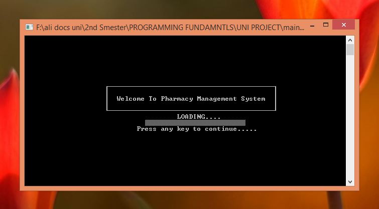
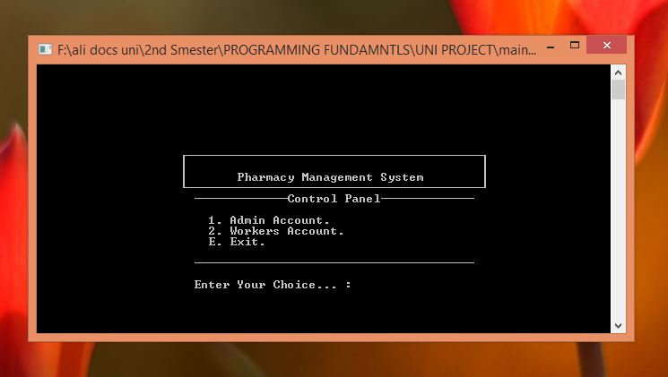
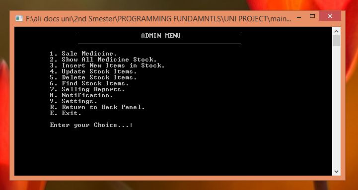
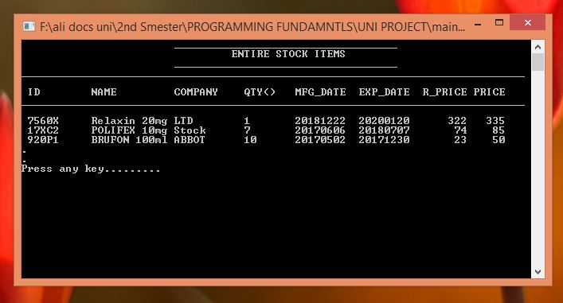
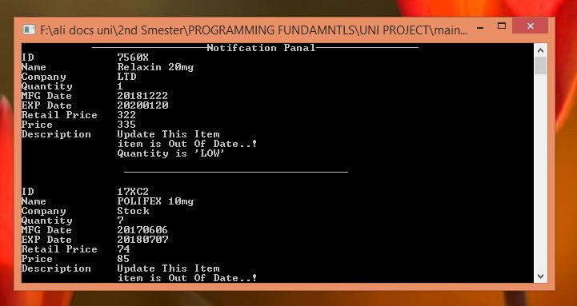
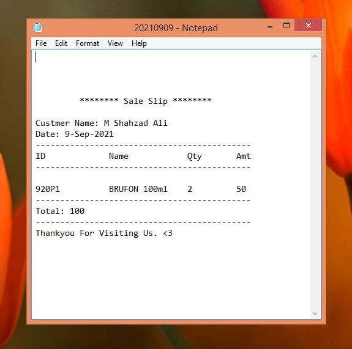

# Pharamcy Management system (Terminal Base)

## Contributors

| Name  | GitHub Profile |
| ------------- |:-------------:|
| Muhammad Shahzad Ali      | [link](https://github.com/shahzad6077)     |
| Abdul Aziz      | [link](https://github.com/approachaziz)     |

## Technologoies used

| Name  | Description |
| ------------- |:-------------:|
| C++      | Develope terminal base application written in c++     |
| File system      | Used as a database     |

## Application Previews

### Entry point

### Control Panel

### Admin View

### List of stock item

### Notification View

### Slip

